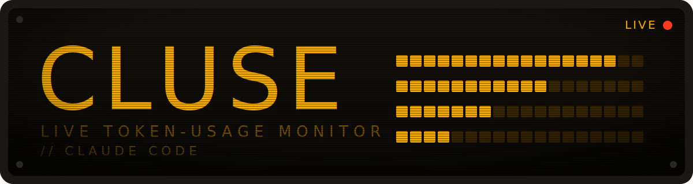
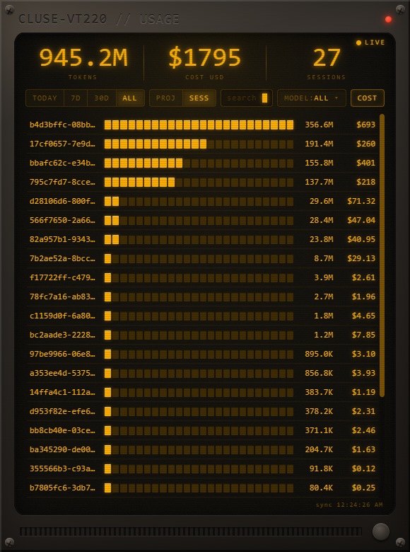
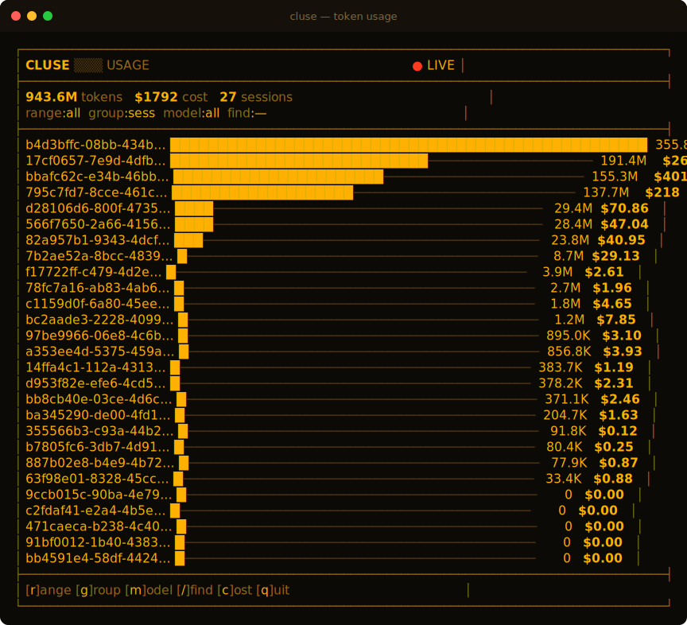

<p align="center">
  
</p>

<p align="center">
  <a href="https://github.com/RRASH111/cluse/releases/latest"></a>
  <a href="https://github.com/RRASH111/cluse/releases/latest"></a>
  
  
  <a href="LICENSE"></a>
</p>

<p align="center">
  <b>A live, retro-amber monitor for your Claude Code token usage.</b><br>
  Reads your local logs — no API keys, no network, nothing leaves your machine.
</p>

---

## ✨ Why

Claude Code quietly logs every session to `~/.claude/projects`. **Cluse** turns that into a
live dashboard so you can actually *see* where your tokens (and dollars) go — by project,
session, model, and time range. Two editions share one engine:

|  | **Desktop** | **Terminal** |
|---|---|---|
| Looks like | An amber CRT terminal | A native TUI in any shell |
| Best for | Leaving open on a second monitor | SSH, tiling WMs, quick checks |
| Get it | [Download installer](#-desktop-windows) | [One command](#-terminal-linux--macos--windows) |

<table>
  <tr>
    <td width="42%"></td>
    <td width="58%"></td>
  </tr>
  <tr>
    <td align="center"><i>Desktop — amber CRT window</i></td>
    <td align="center"><i>Terminal — same data, any shell</i></td>
  </tr>
</table>

## Features

- 📊 **Live updates** — numbers tick up as Claude Code writes new logs
- 🗂️ **Filter & group** by project, session, model, and time range (today / 7d / 30d / all)
- 💸 **Accurate costs** — de-duplicated by message id to match your *billed* usage
- 🎛️ **Per-model breakdown** — opus · sonnet · haiku · fable, with cache read/write split
- 🔌 **Fully offline** — read-only access to local logs, no telemetry, no API keys
- 🪶 **Lightweight terminal mode** — zero required dependencies, runs over SSH

---

## 🖥️ Desktop (Windows)

**[⬇ Download the latest installer](https://github.com/RRASH111/cluse/releases/latest)** →
grab `Cluse-Setup-x.x.x.exe`, run it, done.

Or build from source:

```bash
git clone https://github.com/RRASH111/cluse.git
cd cluse
npm install
npm start            # run from source
npm run build        # produces dist/Cluse Setup x.x.x.exe
```

## 💻 Terminal (Linux / macOS / Windows)

Works in any shell — bash, zsh, PowerShell, Windows Terminal. Requires **Node.js** (you
already have it if you run Claude Code).

```bash
git clone https://github.com/RRASH111/cluse.git
cd cluse
npm install
npm run usage        # interactive live dashboard
```

### Run it from anywhere

Register the command globally:

```bash
npm link             # or: npm install -g .
```

Then, from any directory:

```bash
cluse                          # interactive live dashboard
cluse --once                   # print one snapshot and exit (pipe-friendly)
cluse --once --range all       # all-time totals
cluse --once --model fable-5   # filter to one model
cluse --once --group session   # group by session instead of project
```

On Linux/macOS you can also run the file directly: `chmod +x tui.js && ./tui.js`.
Remove the global command later with `npm rm -g cluse-usage`.

### Keys (interactive mode)

| Key | Action | | Key | Action |
|---|---|---|---|---|
| `r` | cycle time range | | `/` | search (Enter apply · Esc clear) |
| `1`–`4` | Today / 7d / 30d / All | | `c` | toggle cost column |
| `g` | projects ↔ sessions | | `q` | quit |
| `m` | cycle model filter | | | |

> **Tip:** for the best amber colors, use a truecolor terminal (most Linux terminals,
> Windows Terminal, or PowerShell 7). Older consoles still work with approximate color.

---

## How it works

- **Data engine** — `src/usage.js` walks `~/.claude/projects/*/*.jsonl`, extracts per-message
  token usage, de-duplicates by message id, and aggregates by project / session / model / time.
  Plain cross-platform Node, shared by both editions and covered by tests.
- **Pricing** — `src/pricing.js` holds USD-per-million-token rates per model (cache reads/writes
  use Anthropic's standard multipliers). Edit one file to adjust.
- **Privacy** — read-only access to your local logs. No telemetry, no network calls.

## Contributing

Issues and PRs welcome. Run the tests with `npm test`. The data engine is pure and
side-effect-free, so it's easy to test against your own logs.

## License

[MIT](LICENSE) © RRASH111
